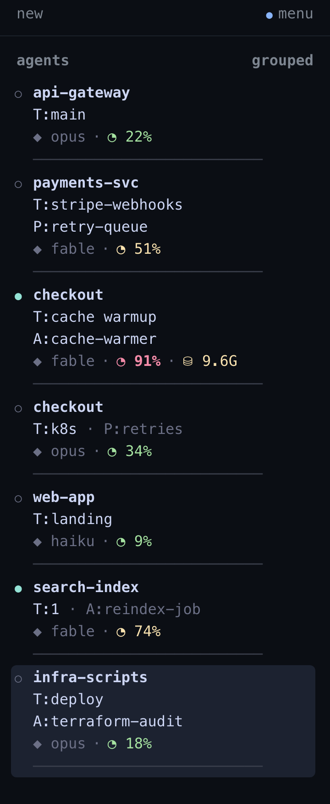

# herdr-agents-info

[](https://github.com/rchougule/herdr-agents-info/actions/workflows/ci.yml)
[](LICENSE)
[](https://github.com/herdrdev/herdr)

**Tell your Claude panes apart at a glance.** A [herdr](https://github.com/herdrdev/herdr)
plugin that gives every Claude Code row in the Agents sidebar a distinguishing name, its
model, and how full its context window is — so a fleet of a dozen agents stops reading as
five identical `dashboard sl…` rows.

<p align="center">
  
</p>

For each Claude pane it pushes display-only tokens:

- a **contextual name** — the git branch, directory, or pane name that tells two
  same-workspace panes apart;
- the **model** (`opus` / `fable` / `sonnet` / …);
- a color-coded **context %** — green under 50, amber 50–79, red at 80+.

Everything is read fresh from each session's transcript. herdr itself is never modified,
there is no daemon, and non-Claude panes keep herdr's default layout.

## Install

```bash
herdr plugin install rchougule/herdr-agents-info
```

This builds from source, so `cargo` must be on the machine. Then apply the
[config recipe](#config-recipe) and reload with `herdr server reload-config`.

<details>
<summary>From a local clone (for development)</summary>

```bash
git clone git@github.com:rchougule/herdr-agents-info.git
cd herdr-agents-info
cargo build --release   # plugin link does NOT build for you
herdr plugin link "$PWD"
```

Re-run `cargo build --release` after every code change. See
[`qa/README.md`](qa/README.md) for the fixture-driven screenshot loop.
</details>

## Config recipe

herdr decides *where* each field lands; this plugin supplies the values. Replace any
existing `[ui.sidebar.agents.rows_by_agent]` block in `~/.config/herdr/config.toml`
with the whole block below, then run `herdr server reload-config`:

```toml
[ui.sidebar.agents.rows_by_agent]
claude = [
  ["state_icon",
    { token = "workspace",  bold = true },
    { token = "$ctx_ok",    fg = "#a6e3a1", bold = true },
    { token = "$ctx_warn",  fg = "#f9e2af", bold = true },
    { token = "$ctx_hot",   fg = "#f38ba8", bold = true },
    { token = "$model",     dim = true }],
  [{ token = "$tab",  dim = false }, { token = "$d2", dim = true }],
  [{ token = "$pane", dim = false }, { token = "$d3", dim = true }],
]
```

Each field has one fixed home: line 1 is metadata (workspace · context % · model),
lines 2–3 are identity (tab, pane, and a derived distinguisher `$d2`/`$d3`). Only one
of `$ctx_ok`/`$ctx_warn`/`$ctx_hot` is ever set, so exactly one color shows. Tokens the
plugin does not set render as nothing, so rows collapse gracefully.

The full rules live in [`docs/naming-framing.md`](docs/naming-framing.md) (what shows,
when) and [`docs/layout-design.md`](docs/layout-design.md) (where it lands).

### Light and dark themes

Hierarchy is carried by **weight** (bold workspace, dim model/derived), which reads on any
background — so the layout itself works in light and dark alike. The only thing that needs
to match your terminal is the three `$ctx_*` colors. The recipe above ships tuned for a
**dark** terminal (catppuccin mocha).

**To retheme:** in the recipe above, change only the `fg` hex on the three `$ctx_*` lines —
leave everything else (including `bold = true`) as is. Then run `herdr server reload-config`.

| token | when it shows | dark (default) | light |
| --- | --- | --- | --- |
| `$ctx_ok`   | context under 50% | `#a6e3a1` | `#40a02b` |
| `$ctx_warn` | context 50–79%    | `#f9e2af` | `#df8e1d` |
| `$ctx_hot`  | context 80%+      | `#f38ba8` | `#d20f39` |

So on a **light** terminal the three lines become:

```toml
    { token = "$ctx_ok",    fg = "#40a02b", bold = true },
    { token = "$ctx_warn",  fg = "#df8e1d", bold = true },
    { token = "$ctx_hot",   fg = "#d20f39", bold = true },
```

**Any other theme:** keep the meaning — `$ctx_ok` a green, `$ctx_warn` an amber, `$ctx_hot`
a red, each with enough contrast against your background — and plug in that theme's hexes.

## Known limitations

- **1M-context detection is a heuristic.** Claude Code transcripts do not record the
  1M-context variant, so the window auto-promotes to 1M once usage passes the 200k
  default (`auto_promote_1m`). A 1M session still under 200k shows an inflated %. Pin it
  with `[context_window.by_model]` in the plugin config.
- **Login/org tokens are off by default** — identical on every row for a single-account
  user. Set `[tokens] login = "always"` to show them.
- **Claude Code only for now.** Codex / Cursor panes keep herdr's default layout.

See [`config.example.toml`](config.example.toml) for every tunable and
[PLAN.md](PLAN.md) for the full design.

## License

[MIT](LICENSE).
